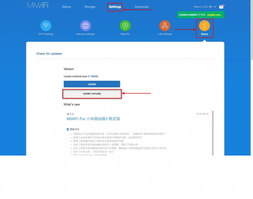
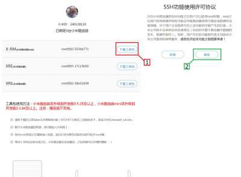

# Добро пожаловать!

## Вы попали на самую полную инструкцию по установке OpenWRT на Xiaomi Mi WiFi 3G первого поколения.

##### Merhaba, 4pda!

##### Недавно приобрел данное чудо китайской инженерии. Посмотрел на опросник и информацию. Чёрт, все на ФуПадиване сидят, а для OpenWRT инструкции разбиты и спрятаны в недрах форума, мол, запретная магия. Ну, что же, попробую помочь тем, кто решил встать на темную сторону OpenWRT и постараюсь повысить процент OpenWRT юзеров в голосовалке. В данном посте попробую объединить все инструкции в один ~~грендайзер~~ мега мануал.

### <u><b>ВНИМАНИЕ!!! Я НЕ НЕСУ ОТВЕТСТВЕННОСЬ ЗА ВАШЕ УСТРОЙСТВО!!! ВЫ ВСЕ ДЕЛАЕТЕ НА СВОЙ СТРАХ И РИСК!!!</b></u>

#### **--> Глава 1. Разлочивание роутера**

*! Нам понадобятся в данной главе ~~клей, изолента и паяльник~~ прямые руки и самая <u>обычная</u> флешка на 2-16Gb !*  

1. Форматируем флешку в FAT32 медленно (убрать галочку с *быстрое*)  

2. Пока флешка форматируется, регистрируем левый аккаунт в Xiaomi: [ссылка](https://4pda.ru/pages/go/?u=http%3A%2F%2Faccount.xiaomi.com%2F&e=95831475 "Ссылка")  

3. Ставим *Xiaomi MiRouter* себе на устройство: [Windows](https://4pda.ru/forum/index.php?showtopic=808656 "Ссылка")/[Android](https://4pda.ru/forum/index.php?showtopic=661224 "Ссылка")/[IOS](https://4pda.ru/pages/go/?u=https%3A%2F%2Fapps.apple.com%2Fru%2Fapp%2Fmi-wi-fi%2Fid859962702%3Fign-mpt%3Duo%253D4&e=95831475 "Ссылка") (Linux и MacOS - сорри, но не сегодня)  

4. Подключаем устройство к роутеру, а роутер к интернету через Xiaomi MiRouter.  

5. Лучше <u>не</u> менять язык с англо-китайского, а пользоваться, например, Yandex Translate на телефоне.  

6. Выключаем на устройстве (лучше взять Windows) <u>все</u> сторонние интернет соединения (кроме как к роутеру), Bluetooth и мобильные данные  

7. Ждем завершения форматирования и вынимаем флешку  

8. Скачиваем разлоченную официальную прошивку 2.25.124 на флешку: [ссылка](https://4pda.ru/forum/index.php?showtopic=837667&view=findpost&p=78857001 "Ссылка")  

9. Открываем браузер (настоятельно рекомендую Internet Explorer) и переходим в настройки роутера: [http://192.168.31.1/](https://4pda.ru/pages/go/?u=http%3A%2F%2F192.168.31.1%2F&e=95831475 "Ссылка")  

10. Переходим по стрелочкам на картинке ниже и указываем путь к прошивке.  
    
      

11. Перезагружаем устройства и роутер (внимание, роутер должен быть перепрошит на момент перезагрузки).  

12. Очищаем флешку и вытащите её(просто удалите файл прошивки и <u>безопасно</u> извлеките флешку)  

13. Делаем переходим сюда: [https://d.miwifi.com/rom/ssh](https://4pda.ru/pages/go/?u=https%3A%2F%2Fd.miwifi.com%2From%2Fssh&f=https%3A%2F%2F4pda.ru%2Fforum%2Findex.php "Ссылка")  

14. Сайт работает **не**правильно, поэтому необходимо вручную вставлять вначале http**s** при каждом переходе  

15. Если все правильно, вы увидите примерно это:
    
      

16. Создайте где-нибудь у себя (**не на флешке**) текстовый файлик password и туда скопируйте логин и пароль с сайта (см. картинку ниже)
    
     

17. У меня получилось так: (у вас скорее всего будет другой пароль)
    
    ```
    login: root
    pass: 305f8ce
    ```

18. Безопасно извлеките флешку.  

19. Отключить питание роутера, подключить флешку в usb разъем роутера (**не использовать пока хабов**), тонким тупым предметом (но НЕ иголкой) зажать кнопку reset на корпусе роутера и, не отпуская, подать питание.  

20. Когда индикатор на передней панели начнет мигать - отпустить reset и дождаться процесса загрузки.  

21. Если у вас Windows 10 - рекомендую обновить терминал: [Windows Store](https://4pda.ru/pages/go/?u=https%3A%2F%2Fwww.microsoft.com%2Fstore%2FproductId%2F9N0DX20HK701&f=https%3A%2F%2F4pda.ru%2Fforum%2Findex.php "Ссылка")
    
    Если нет - поставите [PUTTY](https://4pda.ru/pages/go/?u=https%3A%2F%2Fwww.putty.org%2F&f=https%3A%2F%2F4pda.ru%2Fforum%2Findex.php "Ссылка") и дальше как-то подстраивайтесь

22. Через вкладку Windows Power Shell подключитесь по ssh: (Вместо root ваш логин из текстового файла):
    
    ```
    ssh root@192.168.31.1
    ```

23. Введите пароль из текстового файла  

24. Если все в порядке- вы увидите знаменитую надпись "ARE YOU OK?" и командную строку.  
    Если доступ не получен, то пробуйте повторять процедуру с другими флешками с пункта 15 - это распространенная проблема.

#### **--> Глава 2. Установка загрузчика**

0. Можно использовать флешку из прошлой главы, главное не перезагружать роутер до перепрошивки, т.к. иногда ssh слетает (редко, но метко)  
1. Форматируем флешку в FAT32 медленно (убрать галочку с быстрое)  
2. Ждем форматирования (можно пока выпить чашечку кофе)  
3. Идем на [https://breed.hackpascal.net/](https://4pda.ru/pages/go/?u=https%3A%2F%2Fbreed.hackpascal.net%2F&f=https%3A%2F%2F4pda.ru%2Fforum%2Findex.php "Ссылка") и качаем файл *breed-mt7621-xiaomi-r3g.bin* на флешку.  
4. Теперь переходим в [https://breed.hackpascal.net/md5sum.txt](https://4pda.ru/pages/go/?u=https%3A%2F%2Fbreed.hackpascal.net%2Fmd5sum.txt&f=https%3A%2F%2F4pda.ru%2Fforum%2Findex.php "Ссылка")  
5. Открываем у себя PowerShell (можно в новом терминале) и пишем команду: (D:\breed-mt7621-xiaomi-r3g.bin замените на путь к файлу на флешке)
   
   ```
   Get-FileHash "D:\breed-mt7621-xiaomi-r3g.bin" -Algorithm MD5
   ```
6. Сравниваем md5 суммы на сайте: они <u>должны</u> сходится, иначе файл поврежден (или плохо скачался или флешка битая)  
7. Безопасно извлекаем флешку.  
8. Вставляем обратно и еще раз сверяем md5 сумму (это не лишнее, т.к. если полетит загрузчик - будет кирпич, а windows хэширует файлы порой очень странным образом)  
9. Ещё раз безопасно извлекаем флешку.  
10. Вставляем её в роутер и подключаемся по ssh к роутеру (пункты 21-23 из прошлой главы).  
11. Узнаем обозначение флешки (В конце списка будет, например sda, sda1, sdb...)- вводим команду:
    
    ```
    mount
    ```
12. Смотрим на команду, но НЕ вводим:
    
    ```
    mtd write /extdisks/sda/breed-mt7621-xiaomi-r3g.bin Bootloader
    ```
13. Как видим, здесь sd**a**, но у вас может быть другая буква (см. в 11)
14. Внимание! Вводим команду из п. 12 в соответствии с п. 13
15. Теперь установлен загрузчик breed и можно приступать непосредственно к прошивке.

#### **--> Глава 3. Сборка OpenWRT**

*пишется....*

#### **--> Источники**

1. [Xiaomi Mi Router 3G – обсуждение - 4PDA](https://4pda.ru/forum/index.php?showtopic=837667&st=8980#entry80934930)

2. [Xiaomi Mi Router 3G – обсуждение - 4PDA](https://4pda.ru/forum/index.php?showtopic=837667&st=0#Spoil-63693893-14)

3. https://www.microsoft.com/en-us/p/windows-terminal-preview/9n0dx20hk701?activetab=pivot:overviewtab

4. [Настройка роутеров Xiaomi Mi Wi-Fi: пошаговая инструкция с фото - Выбирай.net](https://provayder.net/useful/articles/nastroyka-routera-xiaomi-mi-wi-fi/)
